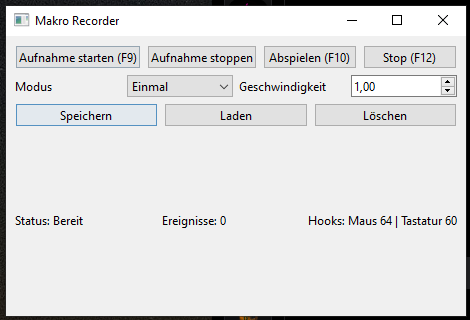

# 🖱️ simple Macro Recorder



A **Macro Recorder for Windows**, built with **Python**, **PySide6**, and **Win32 API**.  
It can **record** mouse movements, clicks, and keyboard inputs, then **replay** them either once or in a loop.

---

## ⚙️ Features
- Start/stop recording (`F9`)
- Start/stop playback (`F10`, `F12`)
- Capture mouse movement, clicks, wheel
- Capture keyboard input
- Save/load macros (JSON)
- Adjustable playback speed
- System tray integration & GUI

---

## 📦 Installation

Clone or download this project, then install dependencies:

```bash
pip install -r requirements.txt
